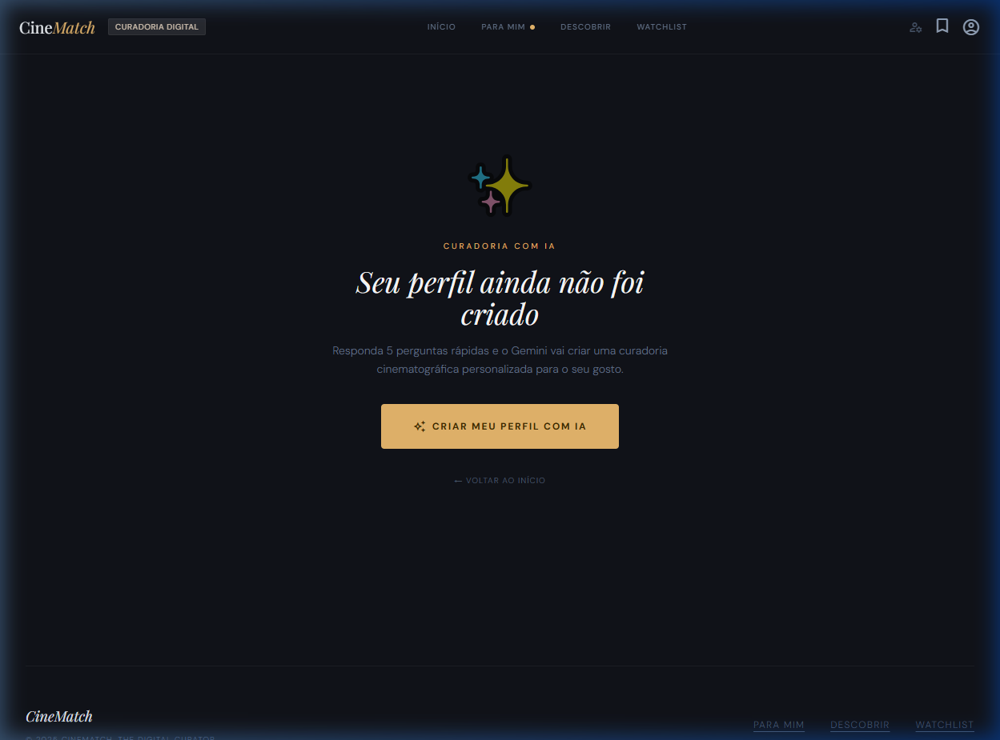
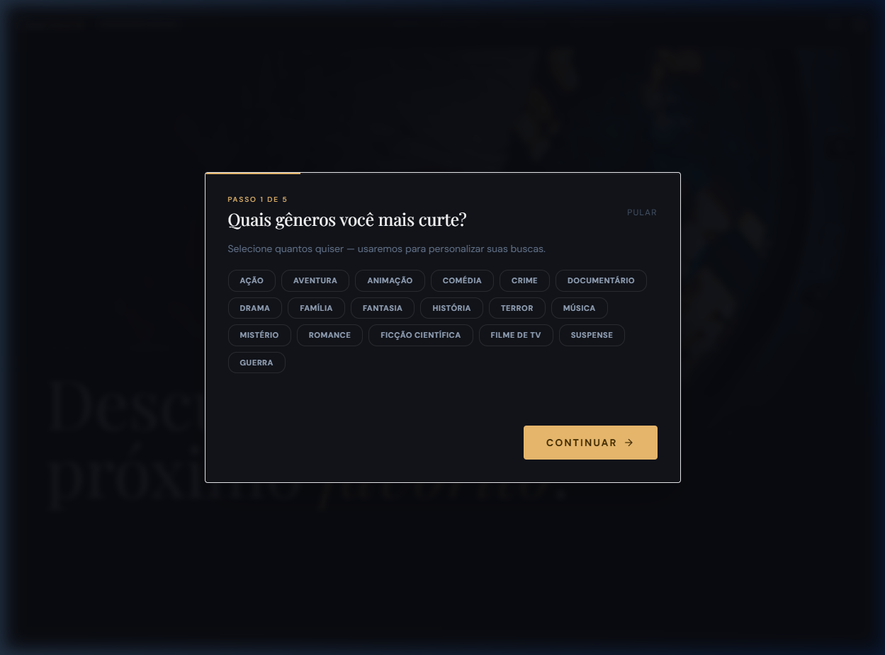
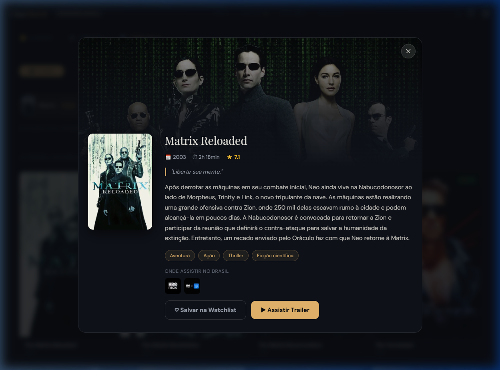
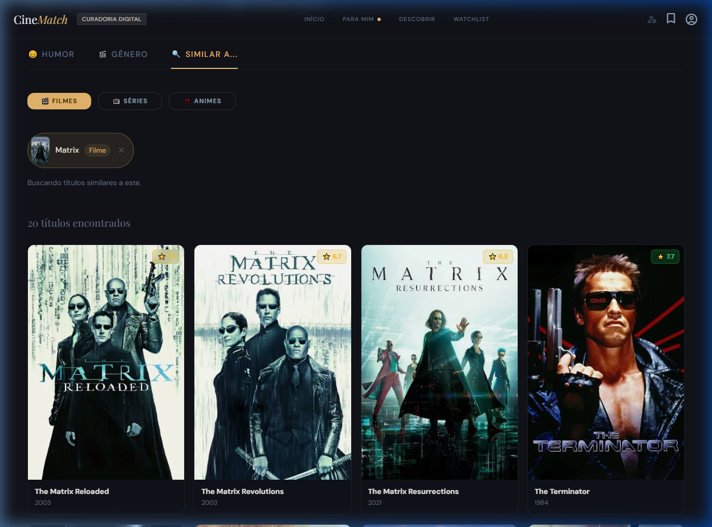
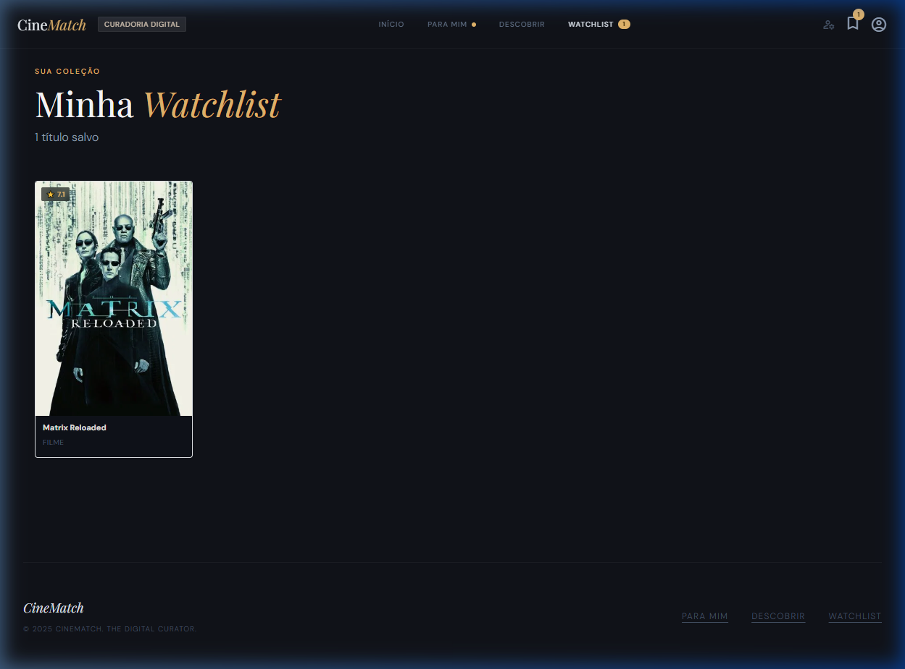

# 🎬 Cinematch - O Seu Curador Digital de Cinema

[](https://cinematch-2yk.pages.dev)

O **Cinematch** é uma plataforma moderna de recomendação de filmes e séries, alimentada por Inteligência Artificial (Google Gemini), para oferecer uma experiência cinematográfica personalizada de verdade. Esqueça o scroll infinito: o Cinematch entende seu gosto e seu humor para sugerir exatamente o que você quer ver agora.

---

## 📸 Screenshots da Aplicação

<div align="center">
  <h3>🏠 Página Inicial e Recomendações de IA</h3>
  
  
  
  <br><br>
  
  <h3>🔍 Ferramentas de Descoberta e Detalhes</h3>
  
  
  
  <br><br>
  
  <h3>📑 Busca e Lista de Desejos</h3>
  
  
</div>

---

## 🔥 Principais Recursos

- **🚀 Onboarding Inteligente:** Um fluxo de 5 etapas para entender seu perfil (gêneros favoritos, décadas, plataformas de streaming e classificações).
- **🤖 Recomendações Gemini AI:** Algoritmos avançados da IA do Google geram uma seção "Para Mim" com títulos sob medida para você.
- **🌈 Descoberta por Humor:** Escolha como você está se sentindo e receba sugestões que combinam com seu estado emocional.
- **🔄 Busca por Similaridade:** Encontre filmes parecidos com seus favoritos com apenas um clique.
- **📡 Onde Assistir? (Watch Providers):** Saiba instantaneamente em quais plataformas de streaming o título está disponível no Brasil (Netflix, Prime Video, Max, etc.).
- **📋 Watchlist Pessoal:** Salve filmes que deseja ver e organize sua maratona.
- **💎 UI/UX Premium:** Design elegante em modo escuro, com animações suaves e responsividade total.

---

## 🛠️ Tecnologias Utilizadas

O Cinematch foi construído utilizando as ferramentas mais modernas do ecossistema front-end:

- **[Angular 21](https://angular.dev/):** Framework robusto para aplicações escaláveis.
- **[Google Gemini AI](https://aistudio.google.com/):** O cérebro por trás das recomendações personalizadas.
- **[TMDB API](https://www.themoviedb.org/documentation/api):** A base de dados de filmes e séries mais completa do mundo.
- **[TypeScript](https://www.typescriptlang.org/):** Tipagem estática para maior segurança e produtividade.
- **[CSS3 (Vanilla)](https://developer.mozilla.org/pt-BR/docs/Web/CSS):** Estilização personalizada para controle total da estética.

---

## 🚀 Como Rodar Localmente

Certifique-se de ter o [Node.js](https://nodejs.org/) e o [Angular CLI](https://github.com/angular/angular-cli) instalados.

1. **Clone o repositório:**
   ```bash
   git clone https://github.com/newericg/cinematch.git
   cd cinematch
   ```

2. **Instale as dependências:**
   ```bash
   npm install
   ```

3. **Inicie o servidor de desenvolvimento:**
   ```bash
   npm start
   ```
   Acesse `http://localhost:4200` no seu navegador.

---

## 📄 Informações Adicionais

Este projeto foi gerado com **Angular CLI** e é otimizado para ser hospedado no Cloudflare Pages.

- **Desenvolvedor:** [@newericg](https://github.com/newericg)
- **Status:** Produção 🚀
- **Licença:** MIT

---

<div align="center">
  <em>Desenvolvido com ❤️ para os amantes da sétima arte.</em>
</div>
